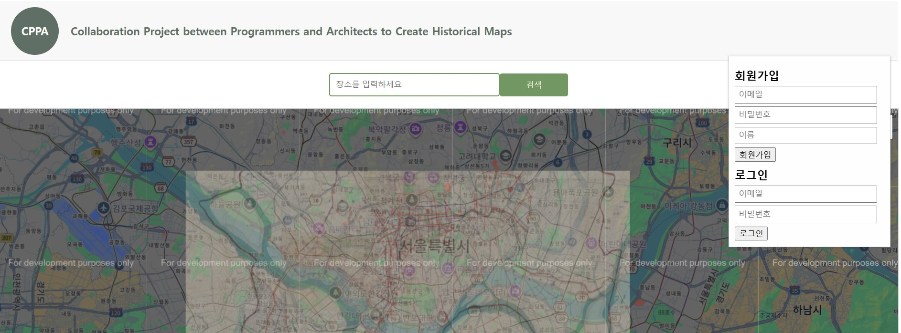

# 🗺️ 서울 시계열 지도 비교 서비스 (Seoul-Map-Compare)

서울의 과거 종이 지도 데이터를 Google Maps API와 결합하여, 도시 구조의 변천사를 직관적으로 비교할 수 있는 웹 프로젝트입니다.

## 🖥️ 서비스 화면


## 📌 주요 기능
* **지도 시계열 오버레이**: Google Maps `GroundOverlay`를 활용한 과거 지도 투영
* **지표 보정**: 이미지 종횡비 및 좌표 변화량을 계산하여 지도 위치 정합성 확보
* **사용자 관리**: `bcrypt` 기반 비밀번호 암호화 및 세션 관리
* **장소 관리(CRUD)**: MySQL 연동을 통한 사용자별 즐겨찾기 저장 및 위치 이동

## 💻 Tech Stack
* **Backend**: Node.js (Express)
* **Database**: MySQL
* **Frontend**: Vanilla JavaScript, CSS3, HTML5
* **API**: Google Maps JavaScript API

## 🛠️ 주요 구현 및 문제 해결
1. **지리 정보 보정 (Georeferencing)**
   - 과거 지도의 왜곡을 해결하기 위해 수작업으로 기준점(GCP) 대조 및 보정 진행
   - 위도 변화량 계산 로직(`getBounds`)을 직접 구현하여 디지털 지도 좌표계와의 정합성 확보
2. **보안 및 유지보수성 강화**
   - API Key 및 DB 접속 정보를 소스코드와 분리하기 위해 `.env` 환경 변수 관리 및 `.gitignore` 적용
   - `express-session`에 `httpOnly` 옵션을 적용하여 클라이언트 측 쿠키 탈취 방지
3. **데이터베이스 설계**
   - **users**: 회원 가입 정보 및 암호화된 비밀번호 관리
   - **favorites**: 사용자별 즐겨찾기 장소명 및 위경도(Lat/Lng) 데이터 관리

## ⚙️ 실행 방법 (Getting Started)
1. **의존성 설치**
   ```bash
   npm install